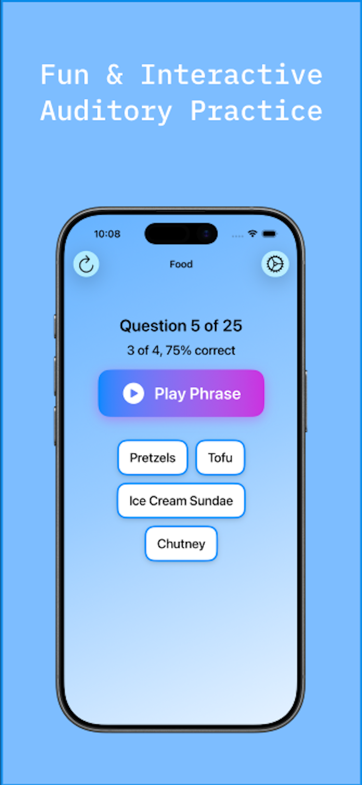
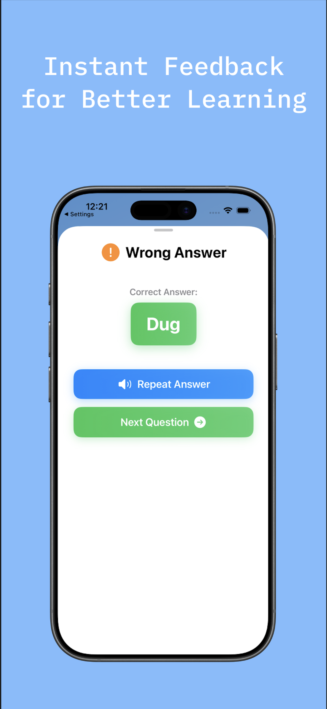
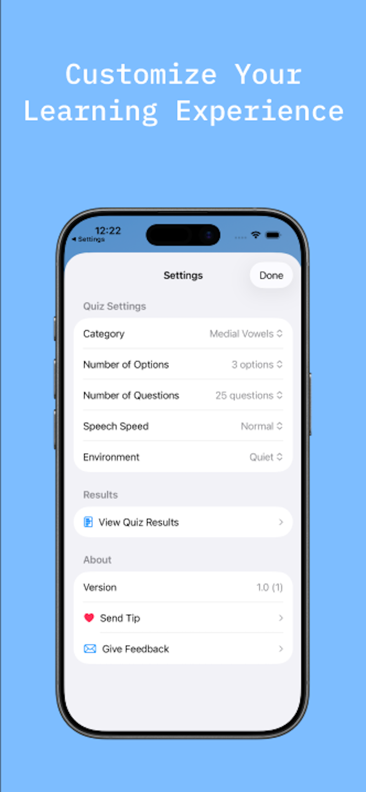
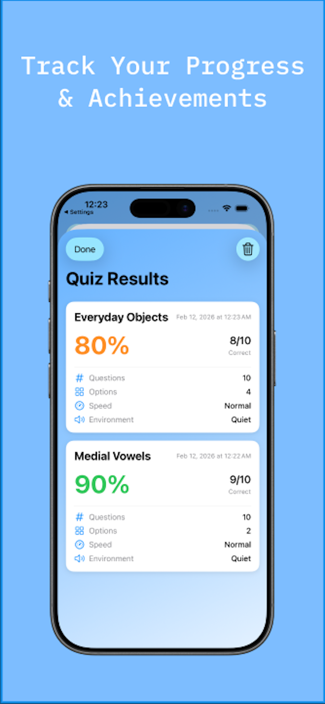

# Cochleo (Hearing Practice)

An iOS listening-practice app for cochlear implant users, built with SwiftUI.

Cochleo speaks a word or phrase out loud and asks you to pick what you heard from a set of
look-alike/sound-alike choices. Everything — speech, background noise, scoring, and even
AI-generated topic packs — runs entirely on the device. No account, no network, no analytics.

| Practice | Instant feedback | Settings | History |
| --- | --- | --- | --- |
|  |  |  |  |

The same screens on iPad: [practice](screenshots/ipad-quiz.png) · [feedback](screenshots/ipad-feedback.png) · [settings](screenshots/ipad-settings.png) · [history](screenshots/ipad-results.png).

## How it works

1. Tap **Play Phrase** — the app speaks one of the on-screen options using `AVSpeechSynthesizer`.
2. Tap the option you think you heard.
3. Correct answers advance immediately; a wrong answer opens a feedback sheet that reveals and
   replays the right one.
4. At the end of the quiz you get a score, and the result is saved to your local history.

## Features

**Practice categories** (`HearingPractice/Quiz Pool/Categories.swift`)

- Phoneme drills: *Initial Consonants*, *Medial Vowels*, *Final Consonants* — each quiz picks one
  contrast group (e.g. all /b/ words, all short-*a* words) so options differ by a single sound.
- Vocabulary sets: *Food*, *Animals*, *Disney*, *Colors & Shapes*, *Action Words*, *Places*,
  *Everyday Objects*, *Nature & Weather*.
- *Phrases* — full sentences grouped into sets of minimally different alternatives.

**Difficulty controls**

| Setting | Options |
| --- | --- |
| Number of options | 2, 3, 4, 5, 6 |
| Number of questions | 10, 25, 50 |
| Speech speed | Slow (0.35), Normal (0.45), Fast (0.55) |
| Environment | Quiet, or Background Noise |

Background Noise mode synthesizes a white-noise WAV in memory and loops it under the speech to
simulate a noisy room — see `AudioPlayer.generateWhiteNoise()`.

**AI Topic Packs** (iOS 26+, Apple Intelligence required)

Type any topic and the on-device Foundation Models framework (`LanguageModelSession` +
`@Generable`) generates ten four-option listening sets about it, previewed before use. The settings
screen surfaces model availability (ready / Apple Intelligence off / device not eligible / still
downloading). No prompt or response leaves the device.

**Results history**

Every finished quiz is stored as a `QuizResult` (date, category, options, questions, correct rate,
speed, environment), JSON-encoded into `UserDefaults`. Viewable, deletable, and clearable from
Settings → View Quiz Results.

**Tip jar**

Four optional consumable IAPs to support development, defined in `Configuration.storekit` for
local StoreKit testing.

## Project layout

```
HearingPractice/
├── HearingPracticeApp.swift        App entry; SwiftData ModelContainer
├── SplashScreenView.swift          Launch animation
├── ContentView.swift               Hosts the quiz; shows the tutorial once per app version
├── WelcomeTutorialView.swift       First-run walkthrough
├── AudioPlayer.swift               AVSpeechSynthesizer + generated white noise
├── Quiz Pool/
│   └── Categories.swift            Category enum and all word/phrase pools
└── RandomQuiz/
    ├── RandomAudioExerciseView.swift   Main quiz screen, question generation, scoring
    ├── RandomQuizSettingsView.swift    Settings, AI pack creator, mail feedback
    ├── QuestionConfigView.swift        Pre-quiz configuration
    ├── ResultsView.swift               Saved-result history
    ├── QuizQuestion.swift / QuizResult.swift
    └── TipJarView.swift                StoreKit 2 tips
```

## Building

Requirements: Xcode with the iOS 26.5 SDK; iPhone/iPad running iOS 26.5 or later.

```sh
open HearingPractice.xcodeproj
# or
xcodebuild -scheme HearingPractice -destination 'platform=iOS Simulator,name=iPhone 17' build
```

- Bundle identifier: `com.yangsong.HearingPractice`
- Display name: **Cochleo** · Version 1.1 (3)
- Swift 5.0, iPhone + iPad (`TARGETED_DEVICE_FAMILY = 1,2`)

To exercise the tip jar in the simulator, select `Configuration.storekit` as the scheme's StoreKit
configuration file. AI Topic Packs need a real Apple Intelligence–capable device with the feature
enabled; the simulator reports the model as unavailable.

## Privacy

No data is collected or transmitted. Quiz results, preferences, and the tutorial flag live in
`UserDefaults` on the device and are removed when the app is deleted. See
[PRIVACY_POLICY.md](PRIVACY_POLICY.md).

## Feedback

In-app: Settings → Give Feedback (opens Mail with app/device details prefilled), or email
rewind.feedback@gmail.com.
